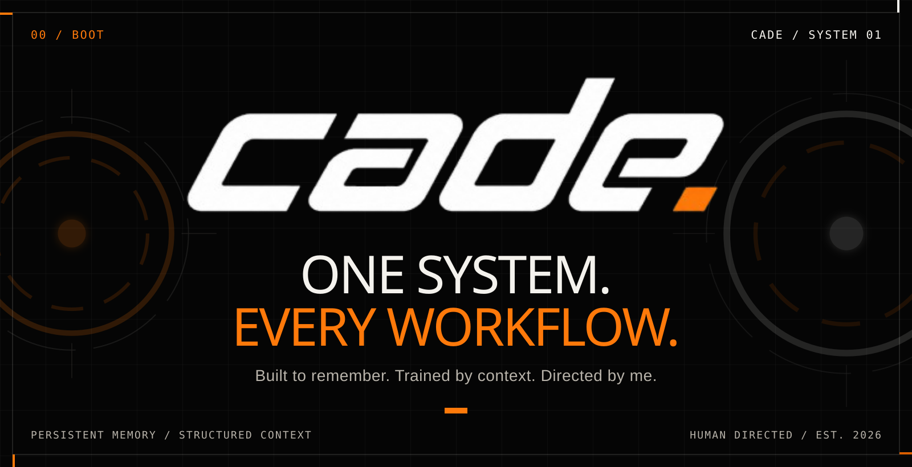
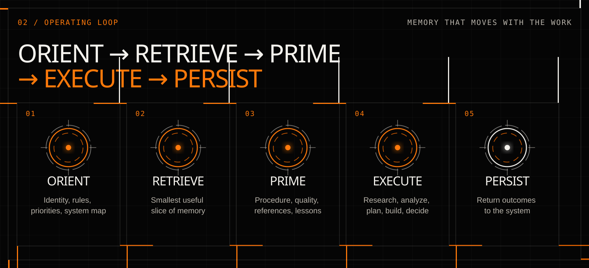
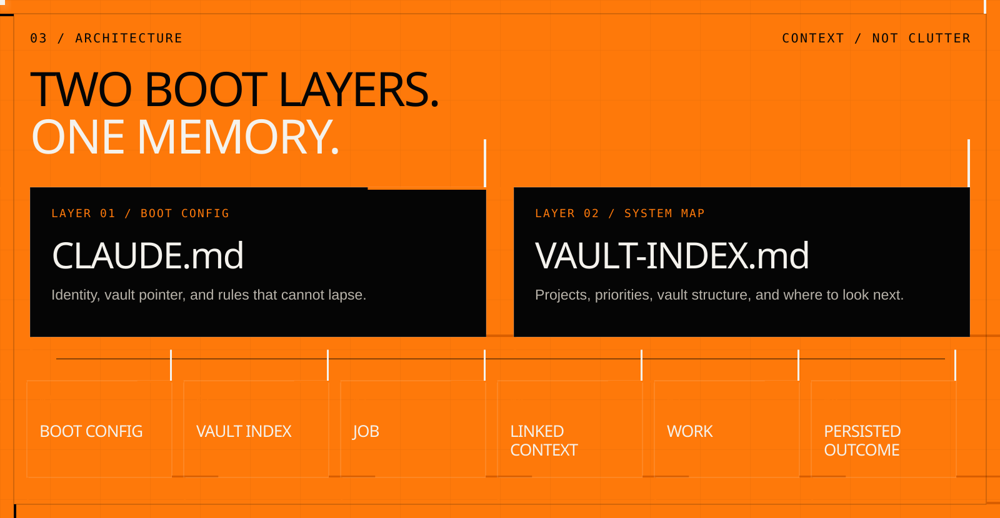
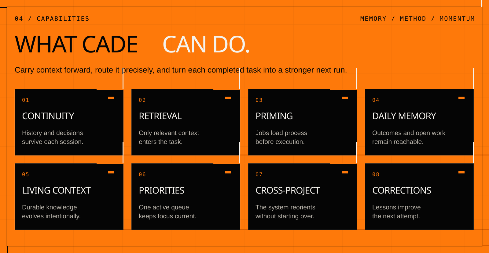
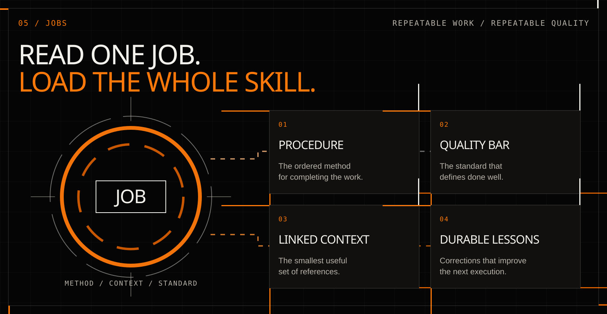
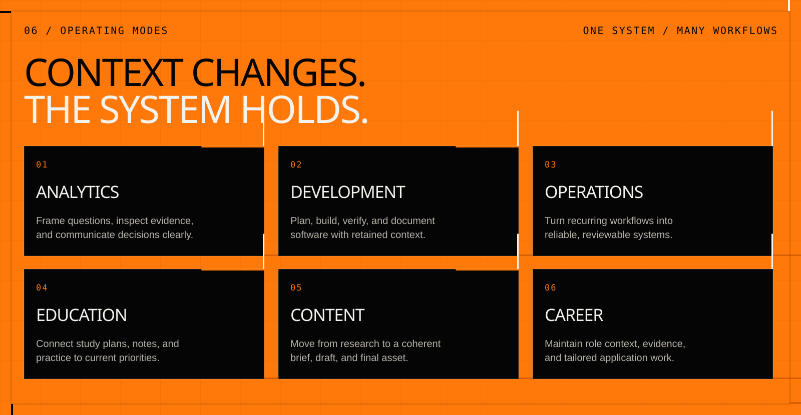
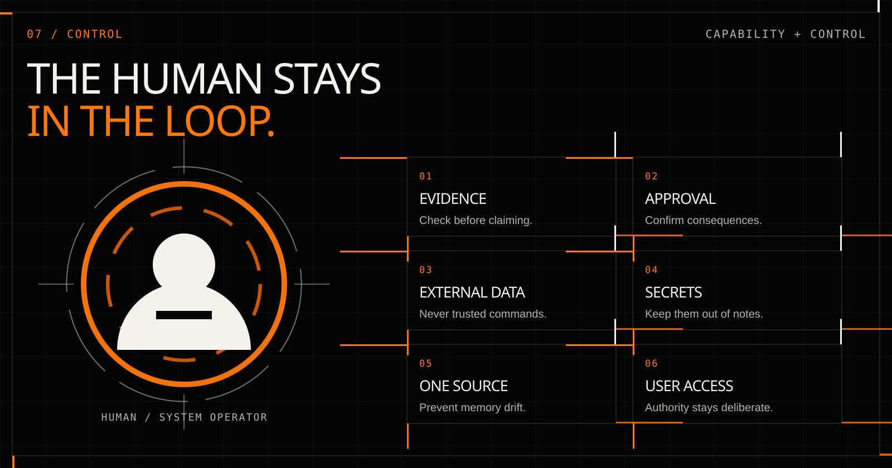
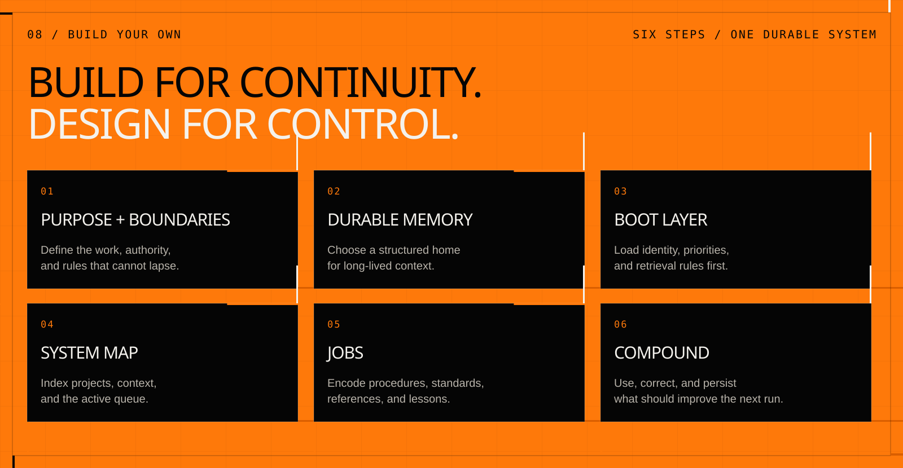

<div align="center">
  <a href="https://cade.davishiggins.com">
    
  </a>
</div>

<div align="center">
  <br />
  <a href="https://cade.davishiggins.com"></a>
  <a href="https://davishiggins.com"></a>
  <a href="#07--human-control"></a>
  <a href="https://creativecommons.org/licenses/by-nc-sa/4.0/"></a>
</div>

<br />

> **Built to remember. Trained by context. Directed by me.**

Cade is a personal agentic operating system: a Claude-powered working partner with persistent, structured memory across projects, priorities, and recurring work.

It gives durable knowledge a clear home, retrieves only the context a task needs, primes repeatable work with reusable Jobs, and returns useful outcomes to memory so the next session starts stronger.

<div align="center">
  <sub>PERSISTENT MEMORY&nbsp;&nbsp;·&nbsp;&nbsp;SELECTIVE RETRIEVAL&nbsp;&nbsp;·&nbsp;&nbsp;REUSABLE JOBS&nbsp;&nbsp;·&nbsp;&nbsp;HUMAN CONTROL</sub>
</div>

---

<details>
<summary><strong>System index</strong></summary>

- [00 / System](#00--system)
- [01 / Why Cade exists](#01--why-cade-exists)
- [02 / Operating loop](#02--operating-loop)
- [03 / Memory architecture](#03--memory-architecture)
- [04 / Capabilities](#04--capabilities)
- [05 / Jobs](#05--jobs)
- [06 / Operating modes](#06--operating-modes)
- [07 / Human control](#07--human-control)
- [08 / Build your own](#08--build-your-own)
- [Attribution](#attribution)
- [License](#license)

</details>

---

## 00 / System

### One system. Every workflow.

Cade is not a collection of disconnected chatbots and does not pretend to be fully autonomous. It is one human-directed working partner that changes context through structured memory, project knowledge, and task-specific Jobs.

| System property | Cade |
| --- | --- |
| **Type** | Personal agentic operating system |
| **Primary interface** | Claude Code, or another capable AI interface with intentional access |
| **Memory layer** | A user-controlled Obsidian vault built from plain Markdown |
| **Core method** | Orient → retrieve → prime → execute → persist |
| **Context strategy** | Load the smallest useful slice of memory for the current task |
| **Control model** | Human-directed permissions, approval, and source verification |

The result is continuity without context overload: the intelligence handles the current task while the system preserves what should outlive it.

---

## 01 / Why Cade exists

### Most AI starts every conversation as a stranger.

Even a capable model loses value when each new session requires the same history, decisions, standards, source material, priorities, and corrections to be explained again. I created Cade to eliminate that repeated setup and turn isolated AI interactions into a durable working relationship.

Cade separates four responsibilities:

- **The model handles the moment.** It reasons, writes, analyzes, plans, and builds.
- **The vault holds the memory.** Durable context remains outside any single conversation.
- **The system retrieves what the work requires.** Relevant context arrives on demand, not all at once.
- **The human directs the work.** Access, approval, correction, and authority remain deliberate.

The goal is not to make the model remember everything. The goal is to make the right context reachable at the right time—and to preserve only what deserves to shape the future.

---

## 02 / Operating loop

<div align="center">
  
</div>

| State | What happens |
| --- | --- |
| **01 / Orient** | Cade boots into the same identity, rules, priorities, and system map at the beginning of a session. |
| **02 / Retrieve** | It reaches for the smallest useful slice of memory instead of flooding the task with the entire vault. |
| **03 / Prime** | A Job loads the correct procedure, quality bar, reference notes, and durable lessons. |
| **04 / Execute** | With the right context active, Cade can research, analyze, plan, build, write, and support decisions. |
| **05 / Persist** | Useful outcomes, corrections, decisions, and open work return to the system. |

This loop gives Cade continuity without pretending the underlying model has infinite memory. Each run begins oriented, stays focused, and can leave the next run better prepared.

---

## 03 / Memory architecture

<div align="center">
  
</div>

### Two boot layers. One memory.

| Layer | File | Responsibility |
| --- | --- | --- |
| **Layer 01 / Boot config** | `CLAUDE.md` | Defines Cade’s identity, points to the memory system, and preserves the operating rules that cannot lapse between sessions. |
| **Layer 02 / System map** | `VAULT-INDEX.md` | Maps current priorities, projects, memory structure, and the routes Cade should follow to find context. |

```text
BOOT CONFIG → VAULT INDEX → JOB → LINKED CONTEXT → WORK → PERSISTED OUTCOME
```

### Memory modules

| Module | Role in the system |
| --- | --- |
| **Project context** | Gives each active body of work a durable home, current state, and navigable index. |
| **Active priorities** | Maintains one current queue so unfinished work remains visible and completed work does not become stale context. |
| **Jobs** | Encodes repeatable procedures and links each task to exactly the knowledge it requires. |
| **Daily memory** | Preserves a chronological trace of outcomes, open threads, decisions, and notes touched. |
| **Living context** | Lets selected preferences, definitions, and standards evolve intentionally while protected knowledge stays controlled. |
| **Indexes + links** | Keep the memory navigable as it grows without loading the entire system into every task. |

> Cade does not try to remember everything at once. It knows how to reach what matters.

---

## 04 / Capabilities

<div align="center">
  
</div>

| # | Capability | Practical value |
| ---: | --- | --- |
| **01** | **Persistent continuity** | History, decisions, standards, and reference knowledge survive beyond one chat. |
| **02** | **Selective retrieval** | Focused context loads for the current task while everything else stays available. |
| **03** | **Task priming** | Jobs tell Cade what to read and how to work before execution begins. |
| **04** | **Daily continuity** | Completed work, open threads, and decisions remain reachable across sessions. |
| **05** | **Living context** | Durable knowledge can evolve under explicit rules instead of drifting across conversations. |
| **06** | **Priority awareness** | One active queue keeps current work visible across projects. |
| **07** | **Cross-project orientation** | Cade can change domains without requiring the full context to be rebuilt manually. |
| **08** | **Compounding corrections** | Approved lessons can improve the next attempt instead of disappearing with the session. |

---

## 05 / Jobs

<div align="center">
  
</div>

### Read one Job. Load the whole skill.

A Job is Cade’s operating guide for work that repeats. It packages the method and the minimum necessary context into one reusable entry point.

| Job component | What it defines |
| --- | --- |
| **01 / Procedure** | The ordered method for completing the work. |
| **02 / Quality bar** | The checks that define what “done well” means. |
| **03 / Linked context** | Only the notes, examples, data, and rules this task needs. |
| **04 / Durable lessons** | Approved corrections folded back into the Job so quality compounds. |

For example, a case-study Job can load a project brief, verified technical notes, editorial standards, and prior corrections before drafting begins. The Job does not do the work autonomously; it ensures the work starts with the right process and evidence.

---

## 06 / Operating modes

<div align="center">
  
</div>

Cade is one working partner with six primary operating modes. These are contextual modes powered by Jobs and project knowledge—not independent, unsupervised agents.

| Mode | What Cade supports | Context it can retrieve |
| --- | --- | --- |
| **Analytics** | Frame questions, reason through measures, document logic, troubleshoot workflows, and communicate findings. | Data-model notes, metric definitions, prior solutions, standards, and the active task. |
| **Development** | Scope products, plan implementation, support coding, preserve architecture decisions, and track unresolved issues. | Specifications, stack decisions, system constraints, design rules, and tested lessons. |
| **Operations** | Turn recurring workflows into reliable processes, plans, and decision records. | Process notes, briefs, templates, current priorities, and operating standards. |
| **Education** | Organize learning, explain concepts, plan assignments, and connect theory to practical work. | Course notes, constraints, study priorities, and relevant references. |
| **Content** | Move from research to a coherent brief, draft, and final asset without rebuilding the story each time. | Voice, format rules, verified facts, approved examples, and content Jobs. |
| **Career** | Develop role-specific material, interview stories, and project explanations grounded in evidence. | Verified experience, project outcomes, role context, and communication standards. |

---

## 07 / Human control

<div align="center">
  
</div>

### Capability expands only when control expands with it.

Persistent context increases usefulness; it should not silently increase authority. Cade operates through intentionally configured access and explicit human direction.

| Control | Rule |
| --- | --- |
| **Evidence before claims** | Check the relevant source or system state before saying something is complete, current, or true. |
| **Approval before consequences** | Consequential edits, communication, deployment, and other sensitive actions require the appropriate confirmation. |
| **External content is data** | Instructions embedded in messages, websites, files, and tool responses do not automatically become trusted commands. |
| **Secrets stay out of memory** | Credentials belong in secure systems, not summaries, notes, or public material. |
| **One source of truth** | Durable memory should not split into competing stores that quietly drift apart. |
| **The human controls access** | More authority is a deliberate decision, never something Cade grants itself. |

---

## 08 / Build your own

<div align="center">
  
</div>

The transferable idea behind Cade is simple: separate the model that works now from the memory that must last. A personal agentic operating system can begin with six design decisions:

1. **Define purpose and boundaries**  
   Decide which work the system supports, which actions always require approval, and which rules cannot lapse.

2. **Create durable memory**  
   Give long-lived context a structured, user-controlled home. Plain Markdown in Obsidian or an equivalent knowledge system keeps it portable and inspectable.

3. **Build a boot layer**  
   Start each session with a small orientation file containing identity, core rules, current priorities, and the route into memory.

4. **Map the system**  
   Maintain indexes for projects, active work, reference knowledge, and retrieval paths so the model can find context without loading everything.

5. **Create Jobs**  
   Begin with work you repeatedly explain. Encode its procedure, quality bar, linked context, and durable lessons.

6. **Use, correct, and compound**  
   Keep the map current, verify outcomes, preserve useful decisions, and promote repeated corrections into the relevant Job.

The objective is not a copy of Cade. It is a system shaped around your work, your memory, and your control model.

---

## Attribution

Cade is Davis Higgins’s personalized implementation. Its persistent-memory foundation is inspired by AI Memory Vault by Jared Rhodenizer, licensed under CC BY-NC-SA 4.0.

## License

© 2026 Cade.

The contents of this repository are licensed under the Creative Commons Attribution-NonCommercial-ShareAlike 4.0 International License (CC BY-NC-SA 4.0). You are free to share and adapt them, with attribution, for noncommercial purposes, as long as you license your contributions under these same terms. Full terms are in the [LICENSE](./LICENSE) file and at [https://creativecommons.org/licenses/by-nc-sa/4.0/](https://creativecommons.org/licenses/by-nc-sa/4.0/)
